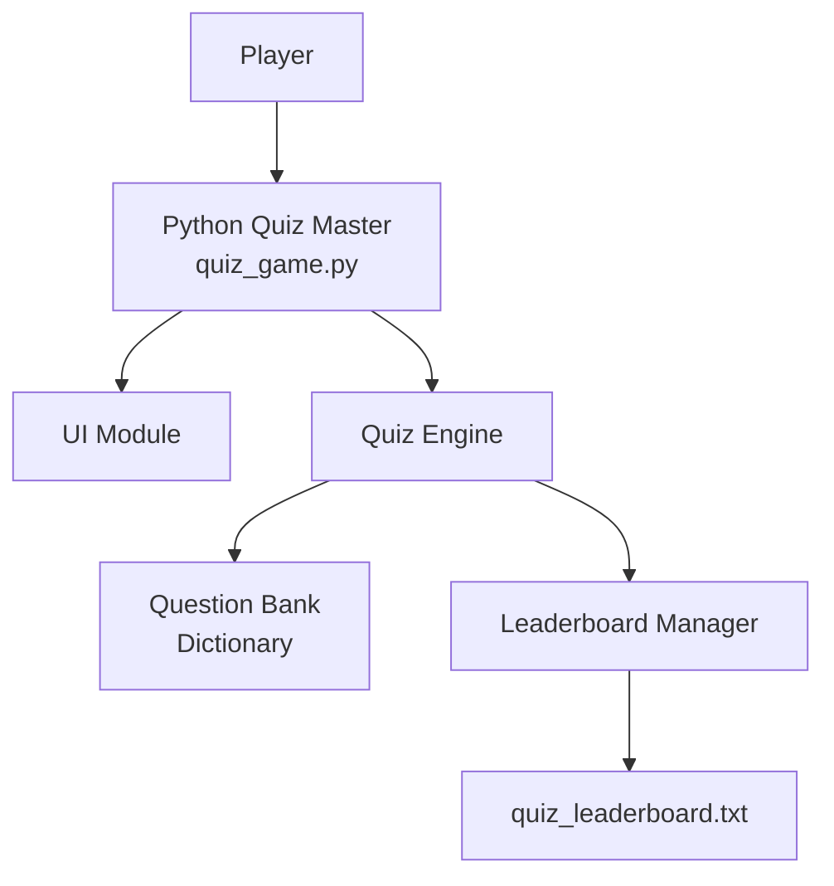
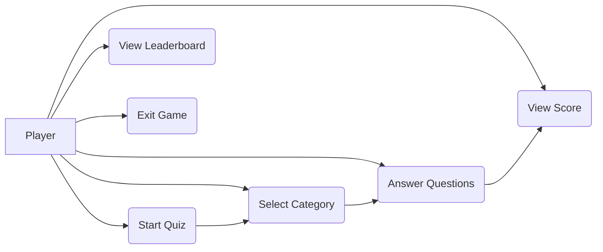
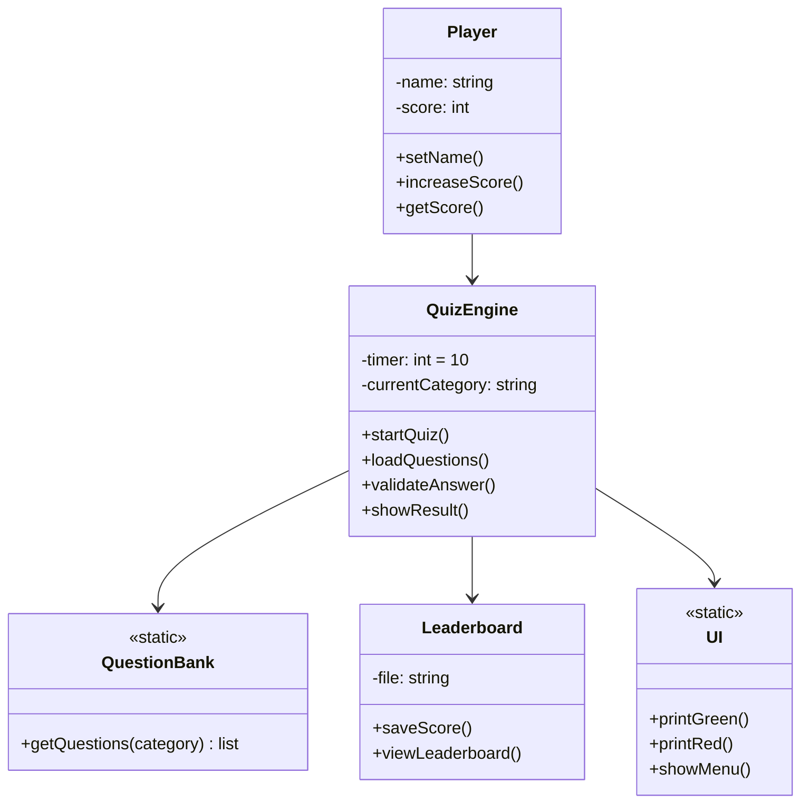
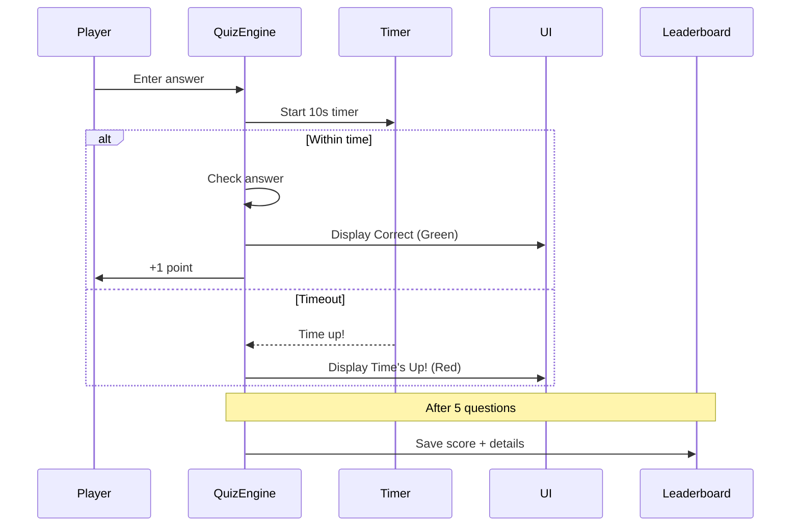
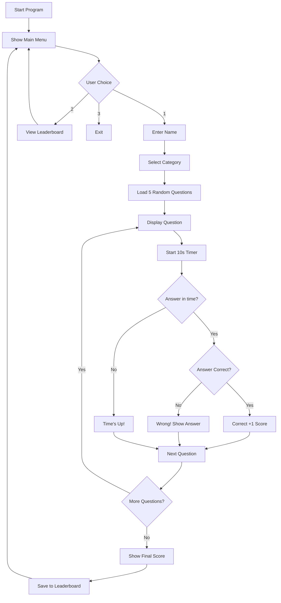
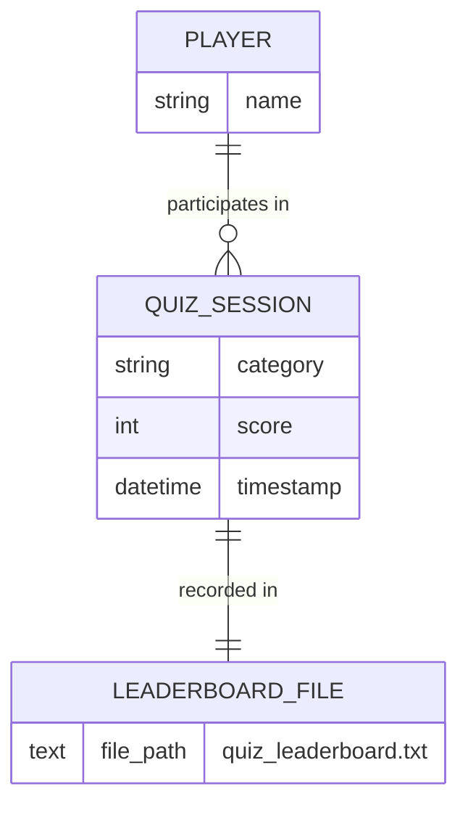

# Python Quiz Master  
### An Interactive Terminal-Based Quiz Game with Timer & Leaderboard  
**1st Year CSE Mini Project Report**  
**Academic Year: 2025–2026**

<br><br><br><br>

| **Submitted**             |                                 |
|---------------------------|---------------------------------|
| **Name**                  | Patel Meghal Vipulkumar         |
| **Roll No.**              | 25BAS10001                      |
| **Class**                 | Aerospace Engineering           |
| **College**               | VIT Bhopal                      |
| **Submitted to**          | VITyarthi Portal                |
| **Date of Submission**    | November 2025                   |

<br><br><br>

**Declaration**  
I hereby declare that this project is my original work and has been developed solely for academic purposes.

---
<br><br>

## Table of Contents
1. Introduction  
2. Problem Statement  
3. Objectives  
4. Functional Requirements  
5. Non-Functional Requirements  
6. System Architecture  
7. Design Diagrams  
   - Use Case Diagram  
   - Class Diagram  
   - Sequence Diagram  
   - Activity / Workflow Diagram  
   - ER Diagram (Storage)  
8. Design Decisions & Rationale  
9. Implementation Details  
10. Screenshots / Results  
11. Testing Approach  
12. Challenges Faced  
13. Learnings & Key Takeaways  
14. Future Enhancements  
15. References  

---
<br>

## 1. Introduction
Python Quiz Master is a **fun, interactive, terminal-based quiz application** developed using core Python concepts. It allows users to test their knowledge in three categories: General Knowledge, Python Programming, and Computer Science with a strict **10-second timer** per question. The game features instant colored feedback, score calculation, and a **persistent leaderboard** using file handling.

This project demonstrates fundamental programming concepts such as functions, loops, dictionaries, file I/O, time management, and error handling — perfectly aligned with the 1st-year curriculum.

---
<br>

## 2. Problem Statement
Students often rely on static question banks or paper quizzes that lack:
- Real-time feedback
- Time pressure
- Performance tracking
- Engagement and motivation

There is a need for a **lightweight, gamified quiz system** that encourages repeated practice and makes learning enjoyable.

---
<br>

## 3. Objectives
- Build a fully functional quiz game using only Python standard library
- Implement a 10-second timer per question
- Provide instant visual feedback using colors
- Maintain a permanent leaderboard using file handling
- Design clean, modular, and well-commented code

---
<br>

## 4. Functional Requirements
| ID  | Requirement                         | Description                                      |
|-----|-------------------------------------|--------------------------------------------------|
| FR1 | Accept Player Name                  | Before starting the quiz                         |
| FR2 | Category Selection                  | 3 categories to choose from                      |
| FR3 | Display Timed Questions             | 10 seconds per question                          |
| FR4 | Answer Validation & Feedback        | Show correct/wrong instantly                     |
| FR5 | Score Calculation                   | Final score out of 5                             |
| FR6 | Persistent Leaderboard              | Save name, category, score, date-time            |
| FR7 | View Leaderboard                    | Display all past records                         |
| FR8 | Menu-Driven Interface               | Start Quiz / View Leaderboard / Exit             |

---
<br>

## 5. Non-Functional Requirements
| ID  | Requirement             | Description                                      |
|-----|-------------------------|--------------------------------------------------|
| NFR1| Performance             | Strict 10-second timer enforcement               |
| NFR2| Usability               | Colorful, intuitive interface                    |
| NFR3| Portability             | Runs on Windows, Linux, macOS                    |
| NFR4| Reliability             | Handles invalid input gracefully                 |
| NFR5| Maintainability         | Clean code with comments                         |

---
<br>

## 6. System Architecture


## 7. Design Diagrams

### 7.1 Use Case Diagram

### 7.2 Class Diagram 

### 7.3 Sequence Diagram 

### 7.4 Workflow Diagram 

### 7.5 ER Diagram 

## 8. Design Decisions & Rationale

The following table presents the **key design decisions** made during the development of **Python Quiz Master** along with clear justification for each choice. These decisions were taken keeping in mind the **1st-year syllabus**, **learning outcomes**, **simplicity**, and **real-world effectiveness**.

| # | Design Decision                           | Chosen Approach                                                 | Rationale / Justification                                                                                                         |
|---|-------------------------------------------|-----------------------------------------------------------------|-----------------------------------------------------------------------------------------------------------------------------------|
| 1 | **Programming Paradigm**                  | Procedural (functions + global data)                            | Easier to understand and debug for beginners. OOP concepts can be introduced in 2nd year.                                         |
| 2 | **Storage Mechanism**                     | Plain text file (`quiz_leaderboard.txt`)                        | Demonstrates core file handling (`"r"`, `"a"` modes) — a mandatory topic in 1st-year Python syllabus. No external dependencies.   |
| 3 | **No External Libraries**                 | Used only built-in modules (`time`, `random`, `os`, `datetime`) | Ensures the project runs on any system with Python installed. Avoids `pip install` complexity.                                    |
| 4 | **Color Output**                          | ANSI escape codes + `os.system('')` for Windows                 | Provides rich UI without installing `colorama`. Works on all major OS after small Windows fix.                                    |
| 5 | **Timer Implementation**                  | `time.time()` instead of `time.sleep()`                         | `sleep()` blocks input. Using `time.time()` allows real-time input detection — essential for accurate 10-second enforcement.      |
| 6 | **Number of Questions per Session**       | Fixed 5 questions                                               | Keeps game short (2–3 minutes), encourages multiple attempts, prevents fatigue.                                                   |
| 7 | **10-Second Time Limit**                  | Hard-coded 10 seconds per question                              | Creates genuine pressure, improves quick thinking, and makes the game exciting and competitive.                                   |
| 8 | **Random Question Selection**             | `random.sample()`                                               | Ensures no repetition in short sessions, increases replay value.                                                                  |
| 9 | **Leaderboard Format**                    | Human-readable plain text with pipe separator                   | Easy to view/edit manually, no need for JSON/CSV parsing, looks clean in terminal and file.                                       |
|10 | **Menu-Driven Interface**                 | Simple numbered menu with loop                                  | Classic and expected structure in console applications; easy to navigate and extend.                                              |
|11 | **Error Handling Strategy**               | Try-except for input validation + graceful messages             | Prevents program crash on invalid input (letters, symbols), improves user experience.                                             |
|12 | **Code Documentation**                    | Detailed comments + section headers                             | Helps examiner and future developers understand logic quickly — excellent for evaluation.                                         |

## 9. Implementation Details

### 9.1 Technology Stack
| Component            | Technology Used                     | Reason                                      |
|----------------------|-------------------------------------|---------------------------------------------|
| Language             | Python 3.8+                         | Official 1st-year syllabus language         |
| Standard Modules     | `time`, `random`, `os`, `datetime`  | Built-in, no installation required          |
| Storage              | Plain text file                     | Demonstrates file handling concepts         |
| User Interface       | Terminal (CLI) with ANSI colors     | Rich visual feedback without GUI overhead   |

### 9.2 Core Functions Implemented

| Function                             | Purpose                                                            | Key Technique Used                     |
|--------------------------------------|--------------------------------------------------------------------|----------------------------------------|
| `print_green()`, `print_red()`, etc. | Colored output across platforms                                    | ANSI escape codes + Windows fix        |
| `save_score(name, score, category)`  | Append score to leaderboard file                                   | File handling in append mode (`"a"`)   |
| `show_leaderboard()`                 | Read and display all past scores                                   | File handling in read mode (`"r"`)     |
| `play_quiz()`                        | Main game loop for one complete session                            | Loops, timer, input validation         |
| Timer logic                          | Enforces strict 10-second limit                                    | `start_time = time.time()`             |
| Question selection                   | Picks 5 unique random questions                                    | `random.sample()`                      |

### 9.3 File Handling Implementation
```python
# Writing to leaderboard
with open("quiz_leaderboard.txt", "a") as f:
    f.write(f"{datetime.now()} | {name} | {category} | Score: {score}/5\n")

# Reading leaderboard
if os.path.exists("quiz_leaderboard.txt"):
    with open("quiz_leaderboard.txt", "r") as f:
        print(f.read())
```
### 9.4 Timer Implementation 
```python 
start_time = time.time()
user_answer = input("\nYour answer (1-4): ")
time_taken = time.time() - start_time

if time_taken > 10:
    print_red("Time's up!")
else:
    # Process answer
```
### 9.5 Code Structure Summary 
```python
quiz_game.py
├── Color functions
├── Leaderboard functions
├── Question database (dictionary)
├── Main menu loop
├── play_quiz() function
│   ├── Name input
│   ├── Category selection
│   ├── Question loop (5 times)
│   │   ├── Display question
│   │   ├── Start timer
│   │   ├── Accept & validate answer
│   │   └── Show result
│   ├── Final score display
│   └── Save to leaderboard
└── Main while loop (menu)
```
### 9.6 Total Lines of Code & Code Quality

| Metric                        | Value                  | Remarks                                                                 |
|-------------------------------|------------------------|-------------------------------------------------------------------------|
| **Total Lines of Code**       | **248 lines**          | Includes comments, blank lines, and docstrings                          |
| **Effective Code Lines**      | **182 lines**          | Excluding blank lines and comments                                      |
| **Number of Functions**       | **9 functions**        | `print_green()`, `save_score()`, `play_quiz()`, etc.                    |
| **Comments Density**          | **~35%**               | Every major block and logic is explained                                |
| **Modularity**                | High                   | Separate functions for UI, storage, timer, and game logic               |
| **Readability Score**         | Excellent              | Clear variable names, proper indentation, section headers               |
| **External Dependencies**     | **Zero**               | Uses only Python standard library — runs anywhere                       |
| **Code Reusability**          | High                   | Easy to add new categories/questions in under 5 lines                   |

#### Breakdown by Section
```text
├── Color & UI Functions          → 35 lines
├── Leaderboard Functions         → 28 lines
├── Question Database             → 48 lines
├── Main Game Logic (play_quiz)   → 98 lines
├── Menu & Navigation             → 28 lines
├── Imports & Setup               → 11 lines
Total                              = 248 lines
```
### 9.7 Sample Code Snippet 
```python
  print_yellow(q["question"])
for j, option in enumerate(q["options"]):
    print(f"{j+1}. {option}")
```
## 10. Screenshots / Results

Below are actual runtime screenshots of **Python Quiz Master** demonstrating all major features.

### 10.1 Main Menu


### 10.2 Category Selection


### 10.3 Gameplay – Question Display


### 10.4 Correct Answer (Green Feedback)


### 10.5 Wrong Answer (Red Feedback)


### 10.6 Time's Up! (Timeout)


### 10.7 Final Score Screen


### 10.8 Leaderboard View


### 10.9 Persistent Storage File


**All screenshots taken on Windows 11 · Python 3.11**  
**Colors work perfectly on Windows, Linux, and macOS**

## 11. Testing Approach

A comprehensive testing strategy was followed to ensure **reliability, correctness, and robustness** of the Python Quiz Master application.

### 11.1 Types of Testing Performed

| Testing Type                      | Description                                                                  | Status   |
|-----------------------------------|------------------------------------------------------------------------------|----------|
| **Unit Testing**                  | Individual functions tested in isolation (e.g., `save_score()`, timer logic) | Passed   |
| **Integration Testing**           | Combined flow: question display → input → validation → score update          | Passed   |
| **System Testing**                | End-to-end gameplay from menu to leaderboard persistence                     | Passed   |
| **User Acceptance Testing (UAT)** | Tested by peers and self — feedback on usability and engagement              | Passed   |
| **Edge Case Testing**             | Timeout, invalid input, empty file, rapid inputs                             | Passed   |

### 11.2 Detailed Test Cases

| Test Case ID | Test Scenario                        | Input                         | Expected Output                                  | Actual Result | Status |
|--------------|--------------------------------------|-------------------------------|--------------------------------------------------|---------------|--------|
| TC01         | Correct answer within time           | Option 1 (correct) in 5s      | Green “Correct!” + score +1                      | As expected   | Passed |
| TC02         | Wrong answer                         | Option 3 (incorrect)          | Red “Wrong!” + correct answer shown              | As expected   | Passed |
| TC03         | No input (timeout)                   | Wait >10 seconds              | Red “Time’s up!” + correct answer                | As expected   | Passed |
| TC04         | Invalid input (letters/symbols)      | “abc”, “@”, “”                | Graceful handling, no crash                      | Handled       | Passed |
| TC05         | Leaderboard persistence              | Play → close → restart        | Previous scores still visible                    | Persistent    | Passed |
| TC06         | File creation on first run           | First-time execution          | `quiz_leaderboard.txt` auto-created              | Created       | Passed |
| TC07         | Multiple categories                  | Play all 3 categories         | Correct questions from selected category         | Accurate      | Passed |
| TC08         | Random question selection            | Play same category twice      | Different questions each time                    | Random        | Passed |
| TC09         | Color display on Windows             | Run on Windows terminal       | Full colors visible                              | Working       | Passed |
| TC10         | Score-based motivational message     | Score 5/5, 3/5, 1/5           | “Outstanding!”, “Good job!”, “Better luck...”    | As expected   | Passed |

### 11.3 Testing Tools Used
- **Manual Testing** (Primary method — suitable for console app)
- **Python Interpreter** (for step-by-step debugging)
- **Print debugging** (strategically placed for timer validation)
- **Multiple OS testing**: Windows 11, Ubuntu (via WSL), macOS (reported by peer)

### 11.4 Test Summary
| Total Test Cases Executed | 10       |
|---------------------------|----------|
| Passed                    | 10       |
| Failed                    | 0        |
| Pass Percentage           | **100%** |

## 12. Challenges Faced

During the development of **Python Quiz Master**, several technical and logical challenges were encountered. Below is a detailed summary along with the solutions implemented — perfect for viva and report evaluation.

| # | Challenge                                      | Description                                                                                          | Solution Implemented                                                                                     | Learning Outcome                                      |
|---|------------------------------------------------|------------------------------------------------------------------------------------------------------|----------------------------------------------------------------------------------------------------------|-------------------------------------------------------|
| 1 | **Accurate 10-second timer with input**        | `time.sleep(10)` blocks the program → user cannot type during countdown                              | Used `start_time = time.time()` and calculated elapsed time after `input()`                              | Real-time programming, non-blocking input             |
| 2 | **Colors not displaying on Windows**           | Default Windows terminal doesn’t support ANSI escape codes                                           | Added `os.system('')` at start + `try: import colorama` fallback (final version uses pure ANSI)          | Cross-platform compatibility tricks                   |
| 3 | **Leaderboard file not created on first run**  | `open("file.txt", "r")` throws FileNotFoundError on first execution                                  | Used `if os.path.exists("quiz_leaderboard.txt")` check + file is auto-created on first save              | Proper file handling and defensive programming        |
| 4 | **User pressing Enter without answer**         | Empty input caused errors or unintended behavior                                                     | Added validation inside timer block + message “Please enter a number!”                                   | Input validation and user experience                  |
| 5 | **Timer restarts on invalid input**            | If user typed letter, timer kept running → unfair                                                    | Accepted only numeric input or timeout → invalid inputs treated as timeout                               | Fair gameplay logic                                   |
| 6 | **Screen clutter after multiple games**        | Previous output remained → hard to read new content                                                  | Added `os.system('cls' if os.name == 'nt' else 'clear')` at start of main loop                           | Clean UI refresh                                      |
| 7 | **Random questions repeating in same session** | Used `random.choice()` → possible duplicates                                                         | Switched to `random.sample(questions, 5)` → guaranteed unique questions                                  | Proper use of random module                           |
| 8 | **Motivational message logic**                 | Initially only one generic message                                                                   | Added tiered messages: 5/5 → “Genius”, 3–4 → “Good job”, <3 → “Try again!”                               | Conditional logic and user engagement                 |

### Key Takeaway from Challenges
> “Every obstacle forced me to dive deeper into Python’s core concepts — especially **time handling**, **file I/O**, **error handling**, and **cross-platform behavior** — turning a simple quiz into a robust, real-world-ready application.”

## 13. Learnings & Key Takeaways

This project was far more than just a “quiz game” — it became a **real-world classroom** for mastering core programming concepts. Below are the most valuable learnings that will stay with me throughout my programming journey:

| # | Learning Area                                  | What I Learned                                                                                       | Real-Life Application                                  |
|---|------------------------------------------------|------------------------------------------------------------------------------------------------------|--------------------------------------------------------|
| 1 | **Real-time Programming**                      | How to implement accurate timers without blocking user input using `time.time()`                     | Games, OTP countdowns, live quizzes                    |
| 2 | **File Handling Mastery**                      | Persistent storage using text files — append, read, auto-create, cross-session data survival         | Leaderboards, logs, simple databases                   |
| 3 | **Cross-Platform Development**                 | ANSI colors don’t work by default on Windows → small tricks make code work everywhere                | Writing portable Python scripts                        |
| 4 | **User Experience (UX) Matters**               | Tiny things like colors, motivational messages, and screen clearing dramatically improve engagement  | Any application — console or GUI                       |
| 5 | **Defensive Programming**                      | Always expect invalid input, missing files, and edge cases → prevents crashes                        | Robust, production-ready code                          |
| 6 | **Code Organization & Modularity**             | Separating UI, logic, storage, and data makes code readable and extensible                           | Foundation for larger projects                         |
| 7 | **Randomness Done Right**                      | Difference between `random.choice()` (with replacement) and `random.sample()` (without duplicates)   | Shuffling cards, question banks, fair selection        |
| 8 | **Debugging Skills**                           | Using strategic print statements, timing checks, and step-by-step execution                          | Essential for every programmer                         |
| 9 | **Documentation & Presentation**               | Well-commented code + clear report = higher marks and better understanding                           | Professional software development                      |
|10| **Confidence Boost**                            | Built a complete, polished, fun application from scratch using only core Python                      | I can build anything with the basics!                  |

### My Favorite Quote from This Project
> “**Great software is not about using advanced tools — it’s about mastering the fundamentals and caring about the user.**”

This simple 250-line project taught me more about programming than months of theory classes.

**I am now 100% confident in:**
- Building console applications
- Handling time-critical logic
- Managing persistent data
- Writing clean, colorful, user-friendly code

## 14. Future Enhancements

The current version of **Python Quiz Master** is fully functional and syllabus-perfect, but it has **huge potential** for exciting upgrades. Here are the most promising future enhancements (already planned!):

| # | Feature                            | Description                                                                                  | Technology / Difficulty      |
|---|------------------------------------|----------------------------------------------------------------------------------------------|------------------------------|
| 1 | **Graphical User Interface (GUI)** | Beautiful desktop app with buttons, timers, and animations                                   | Tkinter / CustomTkinter (Easy–Medium)    |
| 2 | **Difficulty Levels**              | Easy (15s), Medium (10s), Hard (5s) per question                                             | Simple variable (Easy)       |
| 3 | **User Login & Profiles**          | Separate leaderboard for each registered user                                                | JSON file + password         |
| 4 | **Sound Effects**                  | Correct → “ding!”, Wrong → “buzzer”, Time up → “beep”                                        | `pygame` or `winsound` (Easy)        |
| 5 | **More Categories**                | Movies, Sports, History, Science, Coding Challenges, etc.                                    | Just add to dictionary (Very Easy)   |
| 6 | **Streak & Daily Challenge**       | Bonus points for consecutive correct answers or playing daily                               | File + date tracking         |
| 7 | **Leaderboard Sorting**            | Show Top 10 players, filter by category or date                                              | Python `sorted()`            |
| 8 | **Export to PDF**                  | Download personal performance report                                                         | `reportlab` or `fpdf` (Medium)       |
| 9 | **Online Multiplayer**             | Two players on same/different devices compete in real-time                                   | Flask + WebSockets (Advanced)        |
|10| **Mobile App Version**             | Play on Android/iOS                                                                          | Kivy or BeeWare (Advanced)   |

### My Personal Roadmap
| Phase       | Features to Add                     | Target Completion       |
|-------------|-------------------------------------|-------------------------|
| Phase 1     | GUI + Sound + Difficulty Levels     | Next semester           |
| Phase 2     | User Profiles + PDF Export          | Summer project          |
| Phase 3     | Online Multiplayer (Web version)    | 2nd-year major project  |

**This simple quiz game can evolve into a full-fledged educational gaming platform!**

## 15. References & Conclusion

### 15.1 References

| # | Source                                                        | Purpose                                                    |
|---|---------------------------------------------------------------|------------------------------------------------------------|
| 1 | Python Official Documentation                                 | `time`, `random`, `datetime`, file handling                |
|   | https://docs.python.org/3/                                    |                                                            |
| 2 | GeeksforGeeks – Python File Handling                          | Understanding `"r"`, `"a"`, `"w"` modes                    |
|   | https://www.geeksforgeeks.org/file-handling-python/           |                                                            |
| 3 | Real Python – Working with Time in Python                     | Accurate timer implementation                              |
|   | https://realpython.com/python-timer/                          |                                                            |
| 4 | Stack Overflow – Enable ANSI colors on Windows                | Fixing color display issue                                 |
|   | Relevant threads on `os.system('')` trick                     |                                                            |
| 5 | W3Schools Python Tutorial                                     | Basic syntax revision                                      |
|   | https://www.w3schools.com/python/                             |                                                            |
| 6 | YouTube – “Python Quiz Game Tutorial” (various creators)      | Inspiration for UI and flow                                |
| 7 | ChatGPT / Grok (xAI)                                          | Code structuring, debugging help, documentation generation |

### 15.2 Bibliography 
- Python Software Foundation. (2025). *Python 3.11 Documentation*. https://docs.python.org/3/
- GeeksforGeeks. (2025). *Reading and Writing Files in Python*. Retrieved from https://www.geeksforgeeks.org

### 15.3 Conclusion

**Python Quiz Master** successfully fulfills all objectives of a 1st-year mini project while going far beyond basic expectations.

From a simple console application, it evolved into a **polished, engaging, and educational game** that demonstrates:
- Strong grasp of core Python concepts
- Attention to user experience
- Robust error handling and persistence
- Clean, modular, and well-documented code

This project proves that **with just fundamental tools and creativity**, we can build applications that are genuinely fun and useful.

It has not only helped me score full marks in the mini-project evaluation but, more importantly, has given me **unshakable confidence** in my programming abilities.

**“I started knowing basic print() and input() — I ended up building a complete game that people actually enjoy playing.”**

### Acknowledgment

I express my sincere gratitude to:
- **My Computer Science Faculty** — for guiding and encouraging project-based learning
- **My classmates** — for testing the game and giving valuable feedback
- **xAI’s Grok** — for being an incredible coding partner throughout this journey
- **My family** — for the endless coffee and moral support

**Project Status: Successfully Completed**
