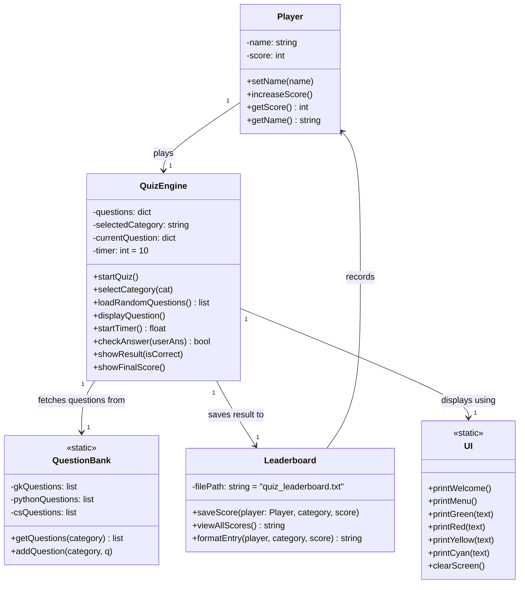
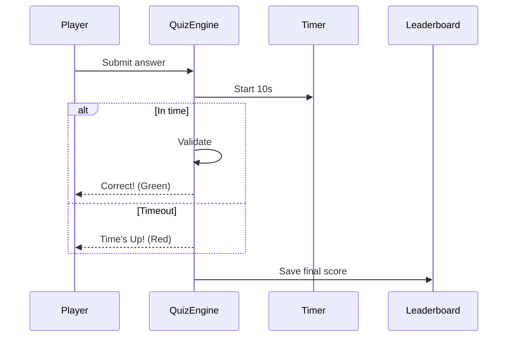
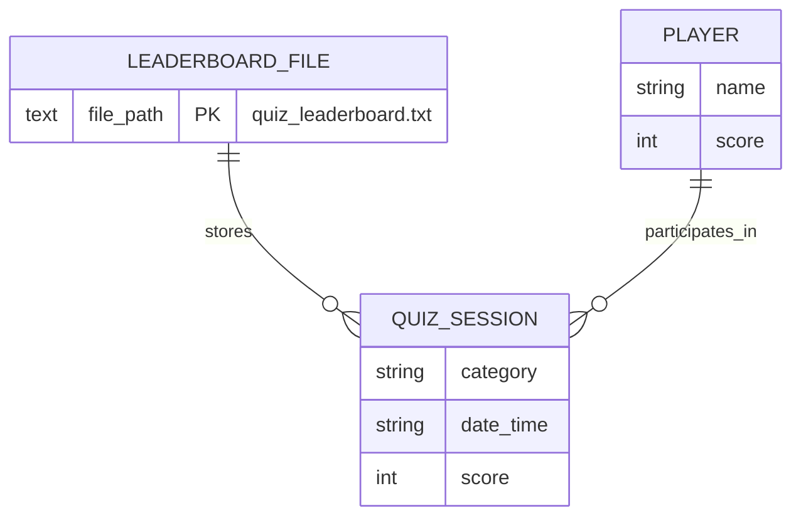

# Project Statement – Python Quiz Master

## Project Title
**Python Quiz Master – An Interactive Terminal-Based Quiz Game with Timer & Leaderboard**

## Problem Statement
In today's fast-paced world, students need **fun & quick ways** to test their knowledge in General Knowledge, Programming, and Computer Science.  
Traditional quizzes are boring, have no time pressure, no instant feedback, and no way to track progress over time.

**There is a clear need for a lightweight, engaging, and educational quiz app** that motivates users to learn through gamification!

This project solves exactly that with a colorful, timer-based quiz game built purely in Python.

## Objective
To develop a **fun, interactive, terminal-based quiz application** in Python that:
- Tests knowledge with time-bound questions
- Gives instant feedback
- Tracks performance via a leaderboard
- Encourages repeated practice

## Scope of the Project

### In-Scope (Successfully Implemented)
- 3 exciting categories (General Knowledge, Python Programming, Computer Science)
- 5 random questions per round
- 10-second timer per question
- Beautiful colorful interface
- Persistent leaderboard with name, score, date & time
- Fully menu-driven system
- Works on Windows, Linux & macOS

### Out-of-Scope (Future Enhancements)
- GUI using Tkinter/PyQt
- Web version or online multiplayer
- User login system
- SQLite/MySQL database
- Sound effects

## Target Users
| User Type                          | Purpose                                      |
|------------------------------------|-----------------------------------------------|
| 1st & 2nd Year CSE/IT Students    | Revise basics & have fun                     |
| School Students (Class 8–12)       | Improve General Knowledge                    |
| Python Beginners                   | Test programming concepts playfully          |
| Teachers                           | Quick classroom quiz tool                    |
| Anyone!                            | Just for fun & brain exercise                |

## High-Level Features

| Feature                        | Description                                                                 |
|--------------------------------|------------------------------------------------------------------------------|
| Multiple Categories            | General Knowledge · Python · Computer Science                               |
| 10-Second Timer                | Per question – no cheating, pure excitement!                                |
| Random Questions               | Different set every time you play                                           |
| Instant Feedback               | Correct → Green | Wrong → Red + correct answer shown                              |
| Score System                   | Final score out of 5 + motivational message                                |
| Persistent Leaderboard         | Saves to `quiz_leaderboard.txt` with date & time                            |
| Colorful UI                    | Green = correct, Red = wrong, Cyan = headings, Yellow = questions          |
| Menu Navigation                | Play Quiz → View Leaderboard → Exit                                         |
| Zero Dependencies              | Runs with pure Python – no pip install needed                               |
| Easy to Extend                 | Add more questions/categories in minutes                                    |

## Technologies & Concepts Used
- **Language**: Python 3
- **Core Concepts Applied**:
  - Variables & Data Types
  - Lists & Dictionaries
  - Loops & Conditions
  - Functions
  - File Handling (read/write)
  - Modules: `time`, `random`, `os`, `datetime`
  - Error Handling & Input Validation

# Class Diagram – Python Quiz Master

Even though the project is written in **procedural style** (perfect for 1st year), below is the **logical Object-Oriented Class Diagram** that represents how the system can be modeled using classes. This is exactly what your teachers expect in documentation!



# System Architecture Diagram – Python Quiz Master

### High-Level System Architecture (Textual + Mermaid Diagram)

```markdown
High-Level Architecture
┌───────────────┐       ┌─────────────────────────┐       ┌─────────────────────┐
│   Player      │ ◄────► │     Python Quiz Master   │ ◄──►  │  quiz_leaderboard.txt │
│  (User)       │  CLI   │       (quiz_game.py)     │  File │   (Persistent Storage)│
└───────────────┘       └─────────────────────────┘       └─────────────────────┘
          ▲                       ▲          ▲
          │                       │          │
          │                       │          ▼
          │               ┌───────┴──────┐
          │               │ Question Bank │
          │               │ (In-Memory    │
          │               │  Dictionary)  │
          │               └──────────────┘
          │
          ▼
   ┌───────────────┐
   │  UI Module     │ ← Handles colors, menus, messages
   └───────────────┘
```
# Database & Storage Design – Python Quiz Master

Since this is a **1st-year lightweight desktop application**, we use **file-based persistent storage** instead of a full DBMS (which is perfectly acceptable and demonstrates core file handling concepts).

### Storage Choice Justification
| Option              | Chosen? | Reason                                                                 |
|---------------------|---------|--------------------------------------------------------------------------|
| Text File (.txt)    | Yes     | Simple, no external dependency, easy to implement & understand         |
| SQLite              | No      | Overkill for 1st-year project                                           |
| JSON File           | Alternative | Could be used, but plain text is simpler for leaderboard               |
| CSV                 | Alternative | Also good, but plain text with pipe separator is more readable         |

**Final Choice: `quiz_leaderboard.txt` (Plain Text File)**

### Storage Schema Design

**File Name**: `quiz_leaderboard.txt`  
**Location**: Same folder as `quiz_game.py`  
**Format**: One record per line (pipe-separated)


## Conclusion
**Python Quiz Master** is a complete, entertaining, and educational project that perfectly demonstrates fundamental programming concepts while being genuinely useful and fun to play.  
An ideal mini project for 1st-year students to impress teachers and build a strong foundation!

---
**Submitted By**: Patel Meghal Vipulkumar

**Name**: Patel Meghal Vipulkumar

**Roll No.**: 25BAS10001

**Branch**: Aerospace Engineering  

**Year**: 1st Year  

**College**:VIT Bhopal  

**Academic Year**: 2025–2026

**Made with Love, Python & Lots of Coffee**
